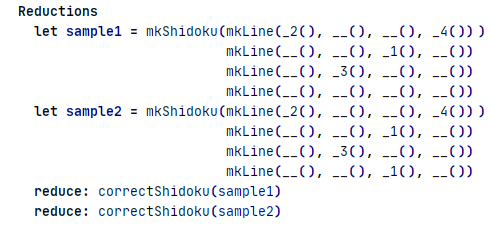
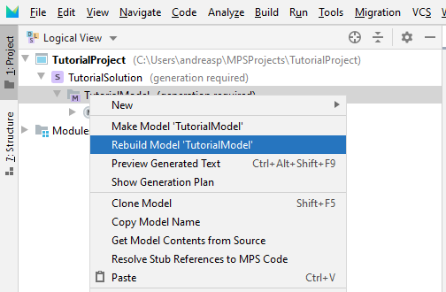

# Tutorial for the use of ACT ONE IDE
Here we describe how to write a Shidoku specification in the IDE.
We do not explain why this is a good specification - you find more information about that in the [User Manual](documentation/UserManual.md).

## Installation
In the folder [distribution](distribution), binaries for Windows, Linux, and Mac are provided.
Extract the distribution and run the actone script. Be patient - the application takes some time to start before showing the splash screen.

## Creating an empty specification
First, you need to create a new project, either by clicking on "New project" or by selecting File -> New Project.
Choose a Solution Project and give the project and the solution a name, e.g. 'TutorialProject' and 'TutorialSolution'.

Now right-click on the TutorialSolution and select new Model. Give the model a name, e.g. 'TutorialModel', press OK and add ActOne as a used language.

Now right-click on the model, and select new -> specification. Insert a name ('SHIDOKU') for the specification, and you have an empty specification.

## Writing the specification
We start by importing the Boolean specification under the **Imports** section by going to the empty list symbol (<< ... >>) and pressing <kbd>Enter</kbd>.
Now we can select BOOLEAN using the code completion menu (<kbd>Ctrl+Space</kbd>).

In a similar way, we add the sorts 'Shidoku', 'Line', and 'Elem' under the **Sorts** section.
We need to type the name of the sort, as this name is what we define.
Pressing <kbd>Enter</kbd> adds another line.

### Adding operators and variables
We can add operators similarly.
First, we add an operator 'oper: mkShidoku : Line Line Line Line -> Shidoku' by pressing <kbd>enter</kbd> under the **Operators** section and filling the name 'mkShidoku'.
Then we go to the space between the colon (':') and the arrow ('->') and press <kbd>enter</kbd>. Now we can select Line from the completion menu (<kbd>Ctrl+Space</kbd>).
We press <kbd>Enter</kbd> three more times and add Line for each of the parameters. Finally, we set the result type 'Shidoku' using the completion menu again.

Now we add more operators as shown in the figure below.

As you see, we need to turn the operators 'mkShidoku', 'mkLine', '_1', '_2', '_3', '_4', and '__' into constructors.
We achieve this by going to the beginning of the line and selecting 'ctor' from the completion menu (<kbd>Ctrl+Space</kbd>).

Now we can easily add the variables by pressing <kbd>Enter</kbd> in the **Variables** section, and adding all the needed variables.
We get a new line by pressing <kbd>Enter</kbd> at the end of the line and a new variable in the same line by pressing <kbd>Enter</kbd> before the colon (':').

### Adding axioms
Adding axioms works in the same spirit: We press <kbd>Enter</kbd> in the **Axioms** section and get a new axiom.
Both sides of the axiom are expressions and we have to fill them with the proper terms.
For most expressions, it is possible to simply write the correct text. If this does not work out, use the completion menu (<kbd>Ctrl+Space</kbd>).
In many cases, using the completion menu is faster than just typing, in particular if you use long and descriptive names.
For example, for the left-hand side of the first axiom, we could start typing "b1" <kbd>Ctrl+Space</kbd> "(mks" <kbd>Ctrl+Space</kbd> "(mkl" <kbd>Ctrl+Space</kbd> "(e1,e2,_,_)".
Add the following axioms using the same approach. It is possible to copy axioms or parts of axioms if they are similar.
For example, after writing the first axiom, you can copy it and modify it to become the second axiom.

For better appearance, you can change the display of operators from horizontal to vertical, as was done for "mkShidoku" in the last axiom and for "And" in the "correctLine" axiom.
Vertical mode is enabled by selecting the operator-term in question and activating the intention "vertical" by pressing <kbd>Alt+Enter</kbd>.

### Adding reductions
In the section **Reductions** it is possible to add reductions or local LET variables.
We want to create two local variables 'sample1' and 'sample2', and then use those for reductions.
Using the completion menu (<kbd>Ctrl+Space</kbd>), we get the choice to insert a let, a reduce, a comment ("#") or an empty line.
We choose a let and set the name to be 'sample1'. Then we add the value as an expression as we already did for the axioms.
In a similar way, we add 'sample2', and the reductions for both of them, leading to the following final part of the specification.

As you notice, it is possible also here to use the vertical presentation mode.
In the reductions, it is also possible to choose debug mode, depth-first mode or limited number of interations.
This can be enabled using intentions (<kbd>Alt+Enter</kbd>) or with the completion menu.

This concludes the writing of the specification. Now we are ready to run the specification.

## Running the specification
The first step to a running specification is to generate code. This is done by right-clicking the model and selecting "rebuild".

The same process works also on the level of the solution or on the project level.

The ACT ONE tool generates Java code that can be executed.
If you are interested in the generated code, you can right-click on your specification and select "preview generated code".
Now we can right-click the specification, and select "run 'Node SHIDOKU'".

This will run the specification and lead to the result 'true()' for sample1, and 'false()' for sample2.