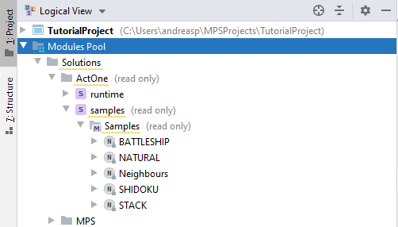
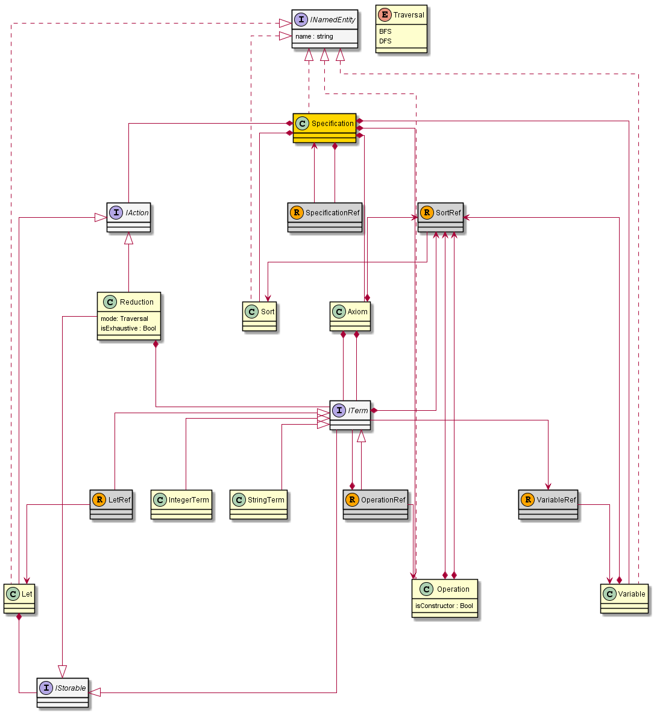

# USER MANUAL FOR ACT ONE IDE
This user manual describes the features of the specification language ACT ONE in the IDE. 
The IDE allows to create ACT ONE specifications and to evaluate terms later.

## Installation
In the current [release](releases), binaries for Windows, Linux, and Mac are provided.
Extract the distribution and run the actone script.

## Using the IDE
The IDE is based on MPS and features a projectional editor. 
This means the editor works over the internal representation of the specification, and the text is just projected to the user.
It is using a model-view-controller (MVC) approach.

Therefore, it is not possible to copy text into the IDE.
It is also not always possible to type the text as it is printed on the screen.
Instead, it is normally possible to select context assistant choices by using <ctrl>-<space>.
In collections (for example a sequence of axioms), a new element can be added by pressing <enter>
In addition, in several places it is possible to change the specification using intentions, which can be activated using <alt>-<enter>.

### Creating a new specification
You create a new solution with your preferred name and a new model inside it.
Add the language ACT ONE as used language in the model properties.
Now you can add a new ACT ONE specification in the model.

### Opening an existing specification
With File-Open or File-Open Recent, you can open existing specifications.
Note: The MPS IDE sometimes has problems when you open several similar specifications in separate windows.
If you experience strange errors, you might want to close all MPS windows apart from your currect window.

### ACT ONE Samples
The ACT ONE IDE comes with a few sample specifications. You find them in the modules pool, Solutions - ACT ONE - samples.



You can use the samples for inspiration, or you can copy them or parts of them for your own designs.

### Copying in the IDE
As already noticed, it is not possible to copy text in the IDE.
However, it is possible to copy from other specifications, for example the sample specifications.
You can mark the relevant part of the specification, and then copy it (<kbd>Ctrl+c</kbd>) and paste it to the place you want (<kbd>Ctrl+v</kbd>).
Make sure that you copy the correct kind of elements to the correct places.
You can also copy a complete specification in the logical view.

## Language ACT ONE
The language used here is similar to the ACT ONE language from the ACT ONE book.
It is adapted to the needs of the course DAT233 at University of Agder.

### Detailed language description
An ACT ONE specification has the following overall format.
```
Specification <name> is
Imports <imports>
Sorts <sorts>
Operators <operators>
Variables <variables>
Axioms <axioms>
Reductions <reductions>
```

`<name>` is an arbitrary name of the specification. <p>
`<imports>` is a list of imported specifications, typically for predefined types.<p>
`<sorts>` is a list of sort (type) names with format `sort <sortname>`.<p>
`<operators>` is a list of operators, where each operator has the format
`oper: <opname> : <inputs> -> <output>`.  <p>
`<inputs>` is a possibly empty list of parameter types for the operator.<p>
`<output>` is the result type of the operator.  <p>
`<variables>` is a list of variables with format `var <varname> : <sort>`.<p>
`<sort>` is the name of a sort.  <p>
`<axioms>` is a list of axioms with format `axiom: <term> = <term>`.<p>
`<term>` is either a variable, or an operator applications with `<term>`s for each parameter.<p>
`<reductions>` is a list of simple reductions with format `reduce : <term>`.  <p>
`<reductions>` can also contain local definitions with the format `let <name> = <term>`.

### Concepts of the language
The following diagram shows the abstract syntax of ACT ONE.


